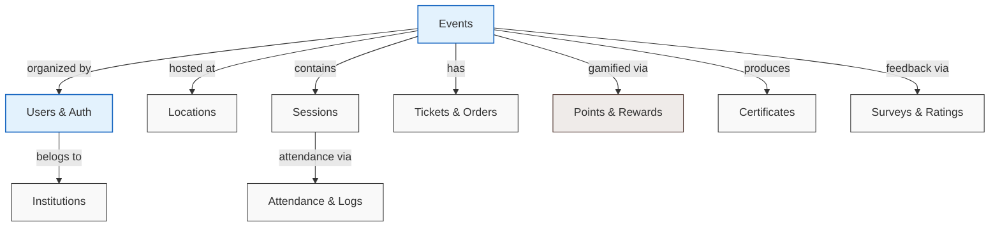

# KampusX Database Schema Analysis

This document provides a comprehensive analysis and categorization of the KampusX database schema as defined in [mysql-schema.sql](file:///d:/laragon/www/kampusx/backend/database/schema/mysql-schema.sql).

The schema comprises **51 tables** supporting user management, institutions, multi-day/session events, ticketing, order transactions, attendance checkpoints, feedback surveys, gamified point systems, dynamic certificate creation, and Laravel framework utility infrastructure.

---

## Database Architecture Overview
The database is structured into 10 functional modules:

---

## Categorized Schema Summary

### 1. User & Authentication Management
Core tables managing user identities, profile credentials, access security, and permissions.

| Table Name | Description | Key Fields & Relationships |
| :--- | :--- | :--- |
| [`users`](file:///d:/laragon/www/kampusx/backend/database/schema/mysql-schema.sql#L911-L934) | Core user profiles, supporting multiple user roles (participant, organizer, admin, committee). | `id`, `name`, `email`, `role`, `status`, `points`, `university_id` (FK to `institutions`) |
| [`password_reset_otps`](file:///d:/laragon/www/kampusx/backend/database/schema/mysql-schema.sql#L646-L651) | Temporary stored OTP (One-Time Password) codes used for verifying email-based password recovery. | `email`, `otp`, `created_at` |
| [`personal_access_tokens`](file:///d:/laragon/www/kampusx/backend/database/schema/mysql-schema.sql#L678-L693) | API access tokens generated by Laravel Sanctum for secure stateless authentication. | `tokenable_type`, `tokenable_id`, `token` |

---

### 2. Institution & Organization Management
Tracks educational institutions, partner corporate organizations, and requests from users to elevate their privileges to host events.

| Table Name | Description | Key Fields & Relationships |
| :--- | :--- | :--- |
| [`institutions`](file:///d:/laragon/www/kampusx/backend/database/schema/mysql-schema.sql#L486-L497) | Houses high-level university, company, or community entity details. | `id`, `name`, `slug`, `type` (enum: university, company, student_org, community) |
| [`institution_user`](file:///d:/laragon/www/kampusx/backend/database/schema/mysql-schema.sql#L469-L481) | Maps users to institutional affiliations, detailing internal roles (owner, admin, member). | `institution_id` (FK), `user_id` (FK), `role` |
| [`organizer_requests`](file:///d:/laragon/www/kampusx/backend/database/schema/mysql-schema.sql#L623-L641) | Onboarding queue where users request to register institutions or upgrade accounts to become organizers. | `user_id` (FK), `institution_id` (FK), `status` (pending, approved, rejected), `proof_path` |

---

### 3. Events & Interest Tagging
Stores metadata for events, categorization tags, geographical placements, and relations linking them together.

| Table Name | Description | Key Fields & Relationships |
| :--- | :--- | :--- |
| [`events`](file:///d:/laragon/www/kampusx/backend/database/schema/mysql-schema.sql#L410-L449) | Core registry of all events, containing scheduling, slug urls, visibility status, and notification triggers. | `id`, `organizer_id` (FK), `institution_id` (FK), `title`, `status` (draft, published, cancelled, ongoing, completed), `views` |
| [`event_locations`](file:///d:/laragon/www/kampusx/backend/database/schema/mysql-schema.sql#L238-L263) | Coordinates, links, and addresses mapping an event to virtual platforms or physical places. | `event_id` (FK), `type` (online, offline, hybrid), `online_quota`, `offline_quota`, `latitude`, `longitude` |
| [`categories`](file:///d:/laragon/www/kampusx/backend/database/schema/mysql-schema.sql#L116-L120) | Pre-defined high-level domains (e.g. Technology, Business) to classify user preferences and events. | `id`, `name` |
| [`category_user`](file:///d:/laragon/www/kampusx/backend/database/schema/mysql-schema.sql#L125-L136) | Pivot mapping representing a user's chosen interests for personalization. | `user_id` (FK), `category_id` (FK) |
| [`event_categories`](file:///d:/laragon/www/kampusx/backend/database/schema/mysql-schema.sql#L195-L204) | Pivot mapping showing which global categories an event represents. | `event_id` (FK), `category_id` (FK) |
| [`event_interest`](file:///d:/laragon/www/kampusx/backend/database/schema/mysql-schema.sql#L224-L233) | Linking events to target interest categories for recommendation purposes. | `event_id` (FK), `category_id` (FK) |
| [`interest`](file:///d:/laragon/www/kampusx/backend/database/schema/mysql-schema.sql#L499-L506) | Backup or supplementary table for user-selectable interests/tags. | `id`, `name` |
| [`event_types`](file:///d:/laragon/www/kampusx/backend/database/schema/mysql-schema.sql#L387-L391) | Stores formats of events (e.g. webinar, talkshow, hackathon). | `id`, `name` |
| [`event_types_event`](file:///d:/laragon/www/kampusx/backend/database/schema/mysql-schema.sql#L396-L405) | Pivot mapping linking events to their respective formats. | `event_id` (FK), `event_types_id` (FK) |
| [`bookmarks`](file:///d:/laragon/www/kampusx/backend/database/schema/mysql-schema.sql#L78-L89) | Bookmarked events saved by users for quick reference. | `user_id` (FK), `event_id` (FK) |
| [`event_collaborators`](file:///d:/laragon/www/kampusx/backend/database/schema/mysql-schema.sql#L209-L219) | Connects external institutions who co-host, sponsor, or sponsor media for specific events. | `event_id` (FK), `institution_id` (FK), `role` (co_host, sponsor, media_partner) |

---

### 4. Event Sessions & Content Delivery
Supports multi-day and multi-session events by organizing timing slots, speakers, downloadable material, and schedules.

| Table Name | Description | Key Fields & Relationships |
| :--- | :--- | :--- |
| [`event_sessions`](file:///d:/laragon/www/kampusx/backend/database/schema/mysql-schema.sql#L304-L325) | Scheduled sessions or tracks within a main event (e.g. Day 1 Morning Seminar). | `id`, `event_id` (FK), `title`, `date`, `start_time`, `end_time`, `prerequisite_session_ids` (JSON) |
| [`speakers`](file:///d:/laragon/www/kampusx/backend/database/schema/mysql-schema.sql#L797-L809) | Registry of speakers participating in events (bios, credentials, media). | `id`, `event_id` (FK), `name`, `role`, `expertise` (JSON), `social_link` (JSON) |
| [`event_session_speakers`](file:///d:/laragon/www/kampusx/backend/database/schema/mysql-schema.sql#L290-L299) | Pivot mapping matching speakers to the exact scheduled sessions they present. | `session_id` (FK), `speaker_id` (FK) |
| [`session_materials`](file:///d:/laragon/www/kampusx/backend/database/schema/mysql-schema.sql#L766-L779) | Study materials, files, or URL links specific to an individual session. | `id`, `event_session_id` (FK), `type` (url, video_file, document), `path_or_url` |
| [`event_materials`](file:///d:/laragon/www/kampusx/backend/database/schema/mysql-schema.sql#L268-L285) | Broader materials tied to the parent event, organized by phases (e.g., pre-reading vs slides). | `id`, `event_id` (FK), `phase` (e.g., before), `file_path`, `content_url` |
| [`event_announcements`](file:///d:/laragon/www/kampusx/backend/database/schema/mysql-schema.sql#L178-L190) | Bulletins, attachments, and update announcements broadcasted to event attendees. | `id`, `event_id` (FK), `title`, `content` |

---

### 5. Ticketing, Orders & Financial Transactions
Tracks ticket options, registrations, invoices, and payment gateway interactions.

| Table Name | Description | Key Fields & Relationships |
| :--- | :--- | :--- |
| [`event_tickets`](file:///d:/laragon/www/kampusx/backend/database/schema/mysql-schema.sql#L364-L382) | Catalog of ticket packages defined by the event organizer. | `id`, `event_id` (FK), `name`, `price`, `capacity`, `type` (online, offline), `is_free` |
| [`orders`](file:///d:/laragon/www/kampusx/backend/database/schema/mysql-schema.sql#L601-L618) | Invoices recording user purchases/reservations of tickets for an event. | `id`, `order_id` (unique tracking code), `user_id` (FK), `event_id` (FK), `amount`, `status` |
| [`order_items`](file:///d:/laragon/www/kampusx/backend/database/schema/mysql-schema.sql#L586-L596) | Individual lines breakdown within an order. | `id`, `order_id` (FK), `quantity`, `price` |
| [`tickets`](file:///d:/laragon/www/kampusx/backend/database/schema/mysql-schema.sql#L889-L906) | The finalized, barcodeable tickets issued to participants. Contains unique secure tokens for QR verification. | `id`, `participant_id` (FK to users), `order_item_id` (FK), `ticket_code`, `qr_token`, `status` |
| [`payment_transactions`](file:///d:/laragon/www/kampusx/backend/database/schema/mysql-schema.sql#L656-L673) | Direct integration log for payment gateway transactions, mapping tokens, status states, and callbacks. | `id`, `token`, `order_id`, `amount`, `status` (e.g. pending, paid) |

---

### 6. Event Staff, Checkpoints & Attendance Tracking
Handles day-of security, check-in stations, and real-time logging of attendee entry/exit logs.

| Table Name | Description | Key Fields & Relationships |
| :--- | :--- | :--- |
| [`event_staff`](file:///d:/laragon/www/kampusx/backend/database/schema/mysql-schema.sql#L330-L341) | Assigns users as operational or administrative staff members for a specific event. | `user_id` (FK), `event_id` (FK) |
| [`event_stations`](file:///d:/laragon/www/kampusx/backend/database/schema/mysql-schema.sql#L346-L359) | Specific check-in desks, halls, or checkpoint stations within an event space. | `id`, `event_id` (FK), `name`, `is_active` |
| [`attendance_links`](file:///d:/laragon/www/kampusx/backend/database/schema/mysql-schema.sql#L27-L43) | Signed, secure QR codes or urls generated to handle dynamic automated attendance check-ins. | `id`, `event_id` (FK), `session_id` (FK), `code`, `signature`, `expires_at` |
| [`attendance_logs`](file:///d:/laragon/www/kampusx/backend/database/schema/mysql-schema.sql#L48-L73) | The core telemetry record logging every scan-in and scan-out at stations. | `id`, `ticket_id` (FK), `user_id` (FK), `event_id` (FK), `post_id` (FK to event_stations), `session_id` (FK), `scan_time`, `checkout_time`, `scanned_by` (FK to staff) |

---

### 7. Gamification & Points Reward System
Tracks engagement metrics via gamified reward systems, user point ledgers, and redemption logs.

| Table Name | Description | Key Fields & Relationships |
| :--- | :--- | :--- |
| [`activities`](file:///d:/laragon/www/kampusx/backend/database/schema/mysql-schema.sql#L10-L22) | Catalogue of point-yielding actions users can perform (e.g., attending a workshop). | `id`, `name`, `slug`, `points_rewarded`, `type` (global, local) |
| [`point_transactions`](file:///d:/laragon/www/kampusx/backend/database/schema/mysql-schema.sql#L698-L718) | Ledger log tracking positive (earning) or negative (redeeming) user point balances. | `id`, `user_id` (FK), `event_id` (FK), `activity_id` (FK), `amount`, `type` (global, local), `reward_id` (FK) |
| [`local_member_points`](file:///d:/laragon/www/kampusx/backend/database/schema/mysql-schema.sql#L543-L555) | Tracks localized point balances accumulated and spendable solely within specific event contexts. | `user_id` (FK), `event_id` (FK), `points_balance` |
| [`rewards`](file:///d:/laragon/www/kampusx/backend/database/schema/mysql-schema.sql#L744-L761) | Catalogue of rewards (physical or digital items) that users can exchange points for. | `id`, `event_id` (FK, for local event rewards), `title`, `points_cost`, `stock`, `reward_type` |
| [`redemption_history`](file:///d:/laragon/www/kampusx/backend/database/schema/mysql-schema.sql#L723-L739) | Records users' reward redemption transactions, shipment status, or cancellations. | `id`, `user_id` (FK), `reward_id` (FK), `points_spent`, `status` (pending, claimed, delivered, cancelled) |

---

### 8. Certificates & Custom Template Layouts
Used to dynamically render completion certificates by overlays text fields onto background image designs.

| Table Name | Description | Key Fields & Relationships |
| :--- | :--- | :--- |
| [`certificate_templates`](file:///d:/laragon/www/kampusx/backend/database/schema/mysql-schema.sql#L162-L173) | Image backdrops and dimension guidelines for certificates issued upon completing events. | `id`, `event_id` (FK), `background_path`, `canvas_width`, `canvas_height` |
| [`certificate_elements`](file:///d:/laragon/www/kampusx/backend/database/schema/mysql-schema.sql#L141-L157) | Specific placement metrics (coordinates, font styling, alignments) to print user names, dates, or custom values on the template. | `id`, `template_id` (FK), `element_type` (e.g. name, date), `position_x`, `position_y`, `font_size` |

---

### 9. Feedback & Event Surveys
Provides organizers with qualitative and quantitative feedback channels directly from participants.

| Table Name | Description | Key Fields & Relationships |
| :--- | :--- | :--- |
| [`surveys`](file:///d:/laragon/www/kampusx/backend/database/schema/mysql-schema.sql#L872-L884) | Surveys created by organizers to collect reviews on events or specific sessions. | `id`, `event_id` (FK), `title`, `session`, `is_active` |
| [`survey_questions`](file:///d:/laragon/www/kampusx/backend/database/schema/mysql-schema.sql#L831-844) | The individual questions defined inside a survey. | `id`, `survey_id` (FK), `type` (e.g. text, rating), `label`, `options` (JSON) |
| [`survey_responses`](file:///d:/laragon/www/kampusx/backend/database/schema/mysql-schema.sql#L849-L867) | High-level responses logged per participant (aggregate ratings and comments). | `id`, `user_id` (FK), `event_id` (FK), `survey_id` (FK), `rating`, `speaker_rating`, `material_rating` |
| [`survey_answers`](file:///d:/laragon/www/kampusx/backend/database/schema/mysql-schema.sql#L814-L826) | Detailed answer records containing values matching specific questions inside a response. | `response_id` (FK), `question_id` (FK), `value` |

---

### 10. Laravel Core Infrastructure
Standard framework-level utilities for migrations, queuing, caching, general settings, and email notifications.

| Table Name | Description | Key Fields & Relationships |
| :--- | :--- | :--- |
| [`migrations`](file:///d:/laragon/www/kampusx/backend/database/schema/mysql-schema.sql#L560-L565) | Track database schema migrations that have been applied. | `id`, `migration`, `batch` |
| [`cache`](file:///d:/laragon/www/kampusx/backend/database/schema/mysql-schema.sql#L94-L100) / [`cache_locks`](file:///d:/laragon/www/kampusx/backend/database/schema/mysql-schema.sql#L105-L111) | Standard key-value cache store and concurrency mutex locks. | `key`, `value` / `owner`, `expiration` |
| [`jobs`](file:///d:/laragon/www/kampusx/backend/database/schema/mysql-schema.sql#L528-L538) / [`job_batches`](file:///d:/laragon/www/kampusx/backend/database/schema/mysql-schema.sql#L511-L523) / [`failed_jobs`](file:///d:/laragon/www/kampusx/backend/database/schema/mysql-schema.sql#L454-L464) | Asynchronous task queue tables tracking pending, grouped, or failed background jobs. | `queue`, `payload`, `attempts`, `failed_at` |
| [`notifications`](file:///d:/laragon/www/kampusx/backend/database/schema/mysql-schema.sql#L570-L581) | Database-based persistent notification feed entries targeting users. | `id` (UUID), `notifiable_type`, `notifiable_id`, `data` (JSON), `read_at` |
| [`settings`](file:///d:/laragon/www/kampusx/backend/database/schema/mysql-schema.sql#L784-L792) | Key-value store configuration records for general system-wide settings. | `key`, `value` |
